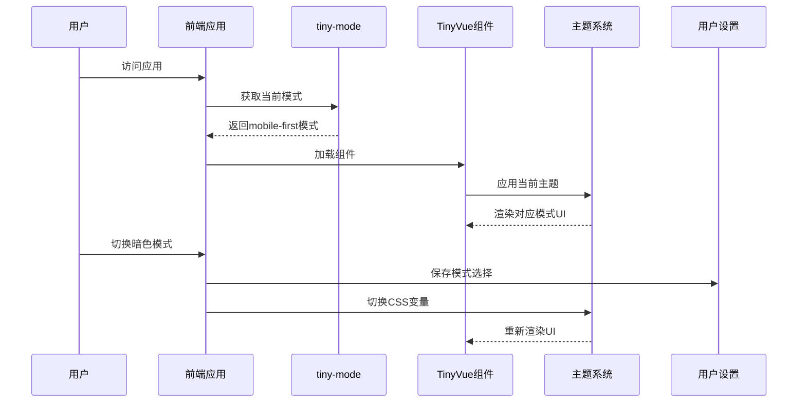

---
# You can also start simply with 'default'
theme: seriph
# random image from a curated Unsplash collection by Anthony
# like them? see https://unsplash.com/collections/94734566/slidev
background: https://images.unsplash.com/photo-1512941937669-90a1b58e7e9c?q=80&w=2070
# some information about your slides (markdown enabled)
title: TinyVue多端模板与模式切换
info: |
  ## TinyVue多端开发与模式透传
  OpenTiny Vue组件库多端模板与模式切换功能介绍
class: text-center
# apply unocss classes to the current slide
drawings:
  persist: false
# slide transition: https://sli.dev/guide/animations.html#slide-transitions
transition: slide-left
# enable MDC Syntax: https://sli.dev/features/mdc
mdc: true
# open graph
# seoMeta:
#  ogImage: https://cover.sli.dev
---

# TinyVue多端模板与模式切换

<div class="pt-12">
  <span @click="$slidev.nav.next" class="px-2 py-1 rounded cursor-pointer" hover="bg-white bg-opacity-10">
    开始探索 <carbon:arrow-right class="inline"/>
  </span>
</div>

<div class="abs-br m-6 flex gap-2">
  <a href="https://github.com/opentiny/tiny-vue" target="_blank" alt="GitHub"
    class="text-xl slidev-icon-btn opacity-50 !border-none !hover:text-white">
    <carbon-logo-github />
  </a>
</div>

<!--
今天我们将讨论TinyVue组件库的多端模板架构及实现模式切换功能
-->

---

# 目录

<Toc maxDepth="1" />

::right::

<div class="mt-14 ml-4">
  
</div>

---

# TinyVue多端模板架构

<div class="mt-10">
OpenTiny Vue是一套企业级UI组件库解决方案，支持多种技术栈与多端适配
</div>

<div class="grid grid-cols-3 gap-6 mt-25">
<div class="flex flex-col items-center">
  <div class="text-3xl mb-2"><carbon-laptop /></div>
  <div class="font-bold">跨框架支持</div>
  <div class="text-sm opacity-75 text-center mt-2">支持Vue2/Vue3技术栈</div>
</div>
<div class="flex flex-col items-center">
  <div class="text-3xl mb-2"><carbon-paint-brush /></div>
  <div class="font-bold">多端适配</div>
  <div class="text-sm opacity-75 text-center mt-2">支持PC端/移动端多端适配</div>
</div>
<div class="flex flex-col items-center">
  <div class="text-3xl mb-2"><carbon-cube /></div>
  <div class="font-bold">Mobile-First模式</div>
  <div class="text-sm opacity-75 text-center mt-2">支持saas主题多端模板</div>
</div>
</div>

<!--
TinyVue具有跨端、跨框架的企业级UI组件库特点，同时支持多种技术栈
-->

---

# Mobile-First多端模板特性

<v-clicks>

- **一套代码，多端适配**
  - 同时适配PC、移动端设备

- **响应式布局**
  - 基于屏幕尺寸自动调整UI布局

- **模式切换与透传**
  - 支持全局切换模式，组件自动适配

- **主题切换**
  - 支持自定义主题，品牌标识

- **统一体验**
  - 保持一致的用户体验，减少维护成本

</v-clicks>

---

# 如何使用Mobile-First多端模板（一）

#### 安装多端相关工具包

```bash
# 安装tailwind及插件
npm i tailwindcss tailwind-merge postcss --legacy-peer-deps
# 安装saas主题包和图标
npm i @opentiny/vue-theme-saas @opentiny/vue-icon-saas
```

#### 配置 tailwind.config.cjs

```js
/** @type { import('tailwindcss').Config } */
const config = require('@opentiny/vue-theme-saas/tailwind.config.js')
module.exports = {
  content: [
    './src/**/*.{html,js,vue}',
    './node_modules/@opentiny/vue-*/lib/*.js'
  ],
  theme: {
    screens: {
      sm: '640px',
      xl: '1000px'
    }
  },
  presets: [config]
}
```

---

# 如何使用Mobile-First多端模板(二)

#### 新增postcss.config.cjs

```js
module.exports = {
  plugins: {
    tailwindcss: {}, 
  }
}
```

#### 创建Tailwind样式文件

```css
/* 在main.js同级目录下创建tailwind.css */
@tailwind base;
@tailwind components;
@tailwind utilities;
```

#### 在入口文件引入并全局切换为 `mobile-first` 模式

```js
// main.js
import { customDesignConfig } from '@opentiny/vue-common'
import { twMerge } from 'tailwind-merge'
import "./tailwind.css";
// 适配层集成twMerge能力
customDesignConfig.twMerge = twMerge
app.config.globalProperties.tiny_mode = { value: 'mobile-first' }

```

---

# 如何使用Mobile-First多端模板(三)

#### 配置 vite.config.js

```js
import { defineConfig } from 'vite'
import vue from '@vitejs/plugin-vue'

// <https://vite.dev/config/>
export default defineConfig({
  plugins: [vue()],
  resolve: {
    alias: {
      '@opentiny/vue-theme': '@opentiny/vue-theme-saas',
      '@opentiny/vue-icon': '@opentiny/vue-icon-saas'
    }
  }
})
```

---

# 设计令牌

<div class="grid grid-cols-1 gap-x-4">
<div>

#### 设计令牌定义

用户可以自己配置一套适合自己的主题系统

```js
// 设计令牌示例
{
  "version": "1.0.0",
  "themeName": "SaaS设计系统主题",
  "themeColor": [
    {
      "mode": "light",
      "data": {
        "brandColor": "#0067D1",
        "backgroundColor": "#FFFFFF",
        "sceneColors": [
          {
            "title": "品牌色 Brand Colors",
            "colors": {
              "color-brand": "brand-500,100",
              "color-brand-hover": "brand-400,100",
...
```

</div>
</div>

---

# TinyVue跨端实现原理

<v-clicks>

- **三层架构**
  - Renderless层：业务逻辑
  - 适配层：对接不同框架
  - UI层：视图表现

- **统一设计系统**
  - 设计令牌封装为CSS变量
  - 跨端统一用户体验

- **多端适配策略**
  - PC/Mobile多端同时支持
  - 媒体查询+条件渲染结合

</v-clicks>

<!--
TinyVue的跨框架实现基于renderless组件设计架构，将业务逻辑与UI表现分离
-->

---

# 实际应用案例

<div class="flex justify-center items-center h-full">



</div>

::right::

# 跨框架微前端应用

<div class="mt-4">

## 基于WUJIE微前端架构

- **框架无关**
  - 同时支持Vue2/Vue3/React/Solid

- **组件复用**
  - 基于Renderless层共享逻辑

- **统一设计规范**
  - 同一套设计令牌，保持一致体验

- **独立开发部署**
  - 子应用可独立开发、构建、部署

<div class="mt-6" v-click>
  
</div>

</div>

---

# 演示：多端UI效果对比

<div class="grid grid-cols-3 gap-8 mt-6">
  <div class="border p-4 rounded-lg shadow-md">
    <div class="text-2xl mb-2"><carbon-laptop /></div>
    <div class="text-lg mb-2 font-bold">PC端</div>
    <div class="bg-gray-100 dark:bg-gray-800 p-2 rounded text-sm mb-4 text-left">
      完整功能集<br>表格高级特性<br>丰富的数据展示<br>复杂表单和布局
    </div>
    <div class="text-xs opacity-70">优化大屏操作体验</div>
  </div>
  
  <div class="border p-4 rounded-lg shadow-md">
    <div class="text-2xl mb-2"><carbon-tablet /></div>
    <div class="text-lg mb-2 font-bold">平板端</div>
    <div class="bg-gray-100 dark:bg-gray-800 p-2 rounded text-sm mb-4 text-left">
      适配触控操作<br>简化部分UI<br>优化交互流程<br>调整元素间距
    </div>
    <div class="text-xs opacity-70">兼顾触控与内容展示</div>
  </div>
  
  <div class="border p-4 rounded-lg shadow-md">
    <div class="text-2xl mb-2"><carbon-mobile /></div>
    <div class="text-lg mb-2 font-bold">移动端</div>
    <div class="bg-gray-100 dark:bg-gray-800 p-2 rounded text-sm mb-4 text-left">
      移动优先设计<br>简化的信息架构<br>触控友好大按钮<br>垂直流式布局
    </div>
    <div class="text-xs opacity-70">专注移动场景体验</div>
  </div>
</div>

<!--
这是TinyVue在不同设备类型下的UI适配效果
-->

---

# 最佳实践与建议

<div class="grid grid-cols-2 gap-x-8 gap-y-4 mt-8">

<div v-click>
  <h3 class="font-bold flex items-center"><carbon-checkmark-outline class="mr-2 text-green-500" /> 移动端优先设计</h3>
  <p class="text-sm opacity-75 ml-6">从小屏设备开始设计，逐步增强到大屏设备</p>
</div>

<div v-click>
  <h3 class="font-bold flex items-center"><carbon-checkmark-outline class="mr-2 text-green-500" /> 全局模式配置</h3>
  <p class="text-sm opacity-75 ml-6">使用全局tiny_mode统一配置当前模式</p>
</div>

<div v-click>
  <h3 class="font-bold flex items-center"><carbon-checkmark-outline class="mr-2 text-green-500" /> 使用CSS变量</h3>
  <p class="text-sm opacity-75 ml-6">利用CSS变量实现主题和模式切换</p>
</div>

<div v-click>
  <h3 class="font-bold flex items-center"><carbon-checkmark-outline class="mr-2 text-green-500" /> 响应式工具类</h3>
  <p class="text-sm opacity-75 ml-6">善用tailwind提供的响应式工具类实现布局</p>
</div>

<div v-click>
  <h3 class="font-bold flex items-center"><carbon-checkmark-outline class="mr-2 text-green-500" /> 持久化用户偏好</h3>
  <p class="text-sm opacity-75 ml-6">记住用户的主题和模式选择</p>
</div>

<div v-click>
  <h3 class="font-bold flex items-center"><carbon-checkmark-outline class="mr-2 text-green-500" /> 分离业务与UI</h3>
  <p class="text-sm opacity-75 ml-6">遵循renderless设计模式分离逻辑与表现</p>
</div>

</div>

<div class="mt-10" v-click>
  <blockquote class="border-l-4 border-blue-500 pl-4 italic">
    TinyVue组件库的多端模板架构让我们能够用统一的代码适配不同设备，提高开发效率，降低维护成本。
  </blockquote>
</div>

---

# 谢谢观看

<div class="mt-12">
  <h3 class="text-xl mb-4">参考资源</h3>
  <div class="flex justify-center gap-8">
    <a href="https://opentiny.design/tiny-vue" class="flex items-center gap-1 opacity-70 hover:opacity-100">
      <carbon-document class="text-lg" /> 官方文档
    </a>
    <a href="https://github.com/opentiny/tiny-vue" class="flex items-center gap-1 opacity-70 hover:opacity-100">
      <carbon-logo-github class="text-lg" /> 项目仓库
    </a>
    <a href="https://github.com/opentiny/cross-framework-component" class="flex items-center gap-1 opacity-70 hover:opacity-100">
      <carbon-code class="text-lg" /> 跨框架示例
    </a>
  </div>
</div>

<!--
感谢大家的聆听，如有问题欢迎讨论
-->
